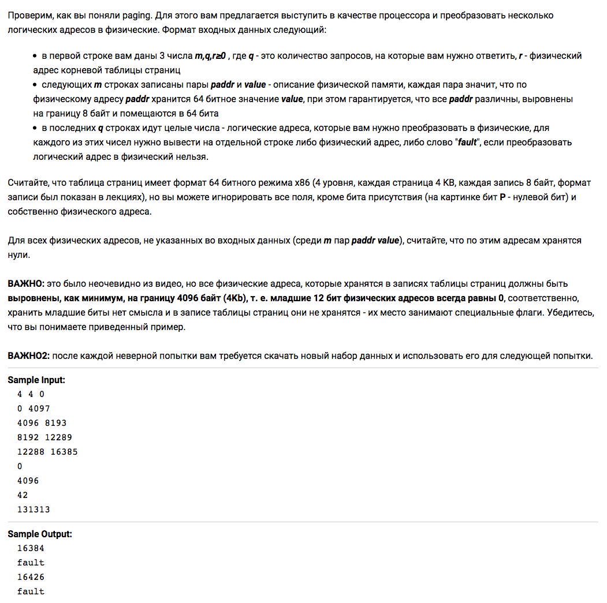
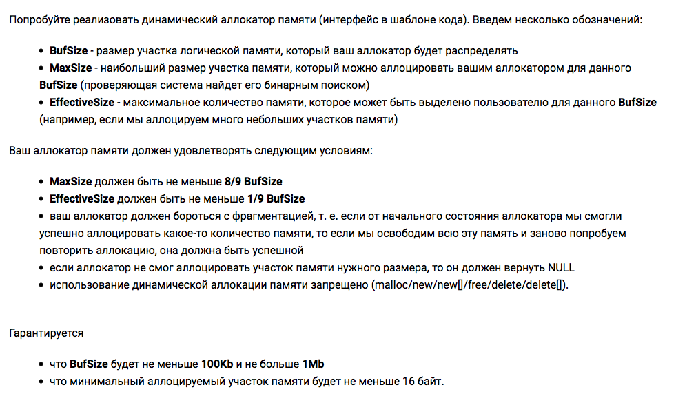
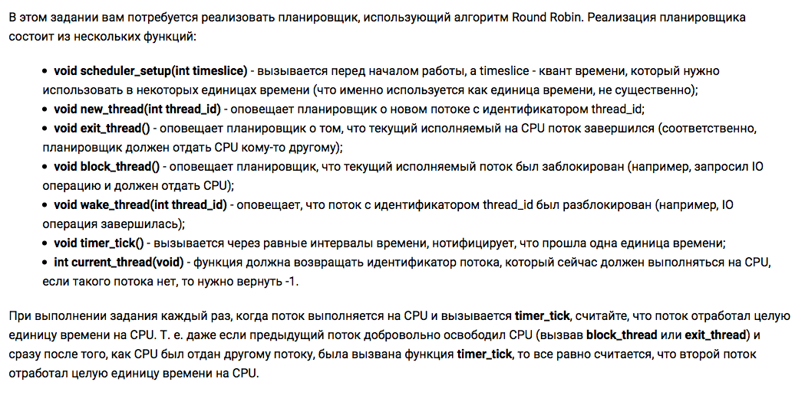

> Решение задач курса [Операционные системы](https://stepik.org/course/1780/).

## 2.4 Страничная организация памяти

### [Степ 15](https://stepik.org/lesson/44327/step/15)

[Решение](lesson-44327/step-15.go)

## 2.5 Простой подход к аллокации памяти

[Решение](lesson-44328/step-9.c)

## 2.7 SLAB аллокатор

[Решение](lesson-44330/step-6.c)

Прочитанное:

- [The Slab Allocator: An Object-Caching Kernel Memory Allocator](https://www.usenix.org/legacy/publications/library/proceedings/bos94/full_papers/bonwick.a)

## 3.4 Планирование и критерии планирования

### [Степ 5](https://stepik.org/lesson/44336/step/5)

[Решение](lesson-44336/step-5.go)

## 3.5 Реалистичное планирование

### [Степ 3](https://stepik.org/lesson/44337/step/3)

[Решение](lesson-44337/step-3.c)

## 4.4 Взаимное исключение с использованием RMW регистров

### [Степ 4](https://stepik.org/lesson/44340/step/4)

[Решение](lesson-44340/step-4.c)

## 4.6 Deadlock-и и средства борьбы с ними

### [Степ 14](https://stepik.org/lesson/44341/step/14)

[Решение](lesson-44341/step-14.c)
